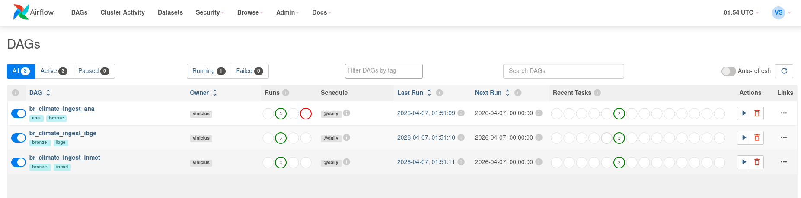

# Climate-data-platform

Este projeto disponibiliza uma pipeline end-to-end usando AWS (s3, Glue e Athena), Airflow, Terraform, Docker e dbt. A ideia é fazer a ingestão de três API publicas: ANA, INMET e IBGE e através de uma arquitetura medalion trazer insights relacionando a chuva com o nível de água nos reservatórios por região. 

Começamos com o bronze:
---
Retiro os dados das API's com Python (Usando pandas e requests para tratar json e xml) -> Salvo em parquets em buckets separados por API no s3 -> Glue Crawler le os parquets e disponibiliza no Catalog -> Tudo orquestrado com airflow dividindo em duas tasks, a ingestão e a trigger do Crawler.  

Imagens do desenvolvimento da camada bronze: 
---

Dags após a finalização do processo de ingestão e trigger:

Terraform configurado:

Crawlers disparados com sucesso:

Demais configurações envolvem: IAM e Airflow connections (explicado mais a frente).
